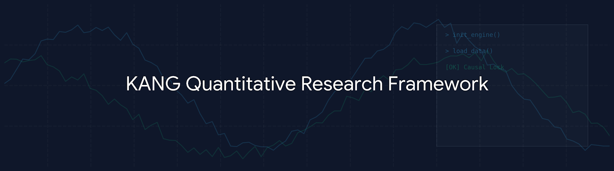

# KANG Quantitative Research Framework

A modular, zero-leakage quantitative research framework designed for simulating, validating, and analyzing systematic market hypotheses.

This repository documents the architecture and research methodology behind a custom-built quantitative testing laboratory. The framework was engineered to enforce strict chronological integrity, generate rich Machine Learning (ML) datasets, and bridge the gap between historical backtesting and live market execution.

---

## 1. Project Overview & Evolution

This project began as a monolithic algorithmic trading system (**Alchemist CE**) designed to execute a specific spatial market geometry. During the validation phase, rigorous parity testing between the historical backtest engine and the Live Execution algorithm revealed a critical methodological flaw: **Future Data Leakage (Look-Ahead Bias)**.

The original backtest was anchoring execution to the _open_ of a timeframe while confirming signals based on the _close_, artificially inflating the strategy's expectancy by placing limit orders against unconfirmed market structure.

Instead of patching the trading bot, the project was completely re-architected from first principles. It evolved into the **KANG Quantitative Research Framework**—a strictly causal, modular laboratory designed to test _any_ quantitative hypothesis without technical debt or timeline corruption.

## 2. Key Framework Capabilities

- **Strict Causal Simulation:** A temporal anchoring engine that enforces $T_{close}$ decision-making. Lower-timeframe arrays are sliced using `np.searchsorted(side="right")` to mathematically guarantee zero future data leakage.
- **Multi-Grid Parameter Testing:** Evaluates multiple spatial entry coordinates and risk models simultaneously, generating a "Long Format" dataset rather than relying on isolated single-pass backtests.
- **Live Execution "Price Improvement Override":** The framework's Live EA logic handles latency and cron-job execution delays seamlessly. If a pending limit order price is surpassed favorably during the execution delay, the system overrides to a direct market order, ensuring optimal institutional fills.
- **Denormalized ML Data Generation:** Exports enriched, anonymized datasets capturing Maximum Favorable Excursion (MFE), Maximum Adverse Excursion (MAE), Time-in-Trade, and Volatility adjustments for external Machine Learning ingestion.

## 3. Core Architecture Flow

The framework strictly enforces the Separation of Concerns between declarative configuration, data ingestion, strategy logic, and artifact export.

1. **Configuration (`config_manager.py`):** Loads static environmental facts from YAML.
2. **Interactive CLI (`cli_wizard.py`):** Dynamically discovers strategy plugins and prompts the researcher for OOS/In-Sample parameters.
3. **Data Lake (`data_loader.py`):** Lazy-loads multi-timeframe Parquet data, parsing and timezone-aligning timestamps.
4. **Stateless Scanners (`level_scanner2.py`):** Processes historical data via vectorized arrays rather than state-machines, ensuring high-speed processing without state corruption.
5. **Artifact Management (`exporter.py`):** Generates hashed, unique CSV outputs alongside `.json` metadata manifests for 100% research reproducibility.

## 4. Documentation Directory

Detailed architectural and methodological overviews can be found in the `docs/` directory:

- [**01. System Architecture**](docs/01_system_architecture.md): The decoupled plugin design and execution pipeline.
- [**02. Research Methodology**](docs/02_research_methodology.md): MFE/MAE profiling, hypothesis testing, and the generation of ML-ready feature sets.
- [**03. Causality & Data Integrity**](docs/03_causality_and_integrity.md): A deep dive into Terminal Candle Blindness, temporal anchors, and the elimination of look-ahead bias.
- [**04. Framework Evolution**](docs/04_framework_evolution.md): The transition from the Alchemist CE monolith to the modular KANG research desk.

## 5. Sanitized Data Export Capabilities

The engine produces datasets specifically engineered for quantitative analysis. While proprietary geometric classifications are kept private, the framework tracks deep execution mechanics, including:

`Setup_ID` | `Setup_Time` | `Direction` | `Orig_Zone_Height_Pips` | `Setup_ATR_Ratio` | `Orig_Zone_Age_Days` | `Stop_Distance_Pips` | `Target_Distance_Pips` | `Entry_Name` | `SL_Model` | `Entry_Filled` | `Outcome` | `RR_Achieved` | `MAE_Pips` | `MFE_Pips` | `Holding_Time_Hours` | `Next_Day_Pulled_Back`

## 6. Current Status & Future Work

**Status:** The baseline framework and chronological engine are complete and actively used to validate mean-reversion and structural shift hypotheses.
**Future Work:**

- Implementation of a Walk-Forward Optimization (WFO) module.
- Integration of Python-based XGBoost feature-importance pipelines directly into the artifact exporter.
- Expanded multi-asset parity testing (Forex, Commodities, Equities).

---

Please see [**NOTICE.md**](NOTICE.md) for information regarding Intellectual Property and the intentional exclusion of proprietary trading logic from this repository.

IMAGE PLACEHOLDERS FOR THIS FILE:

1. Banner Image:
   - Location: Top of README
   - Markdown: 
   - Save As: `diagrams/framework_banner.png`
   - Suggested Content: A sleek, dark-themed banner containing the text "KANG Quantitative Research Framework" with abstract geometric charting lines or a terminal UI faint in the background.
