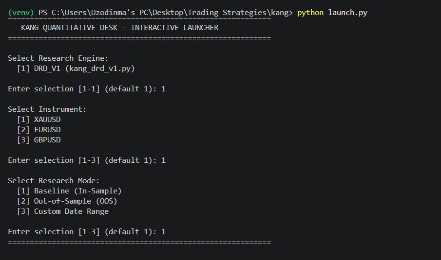
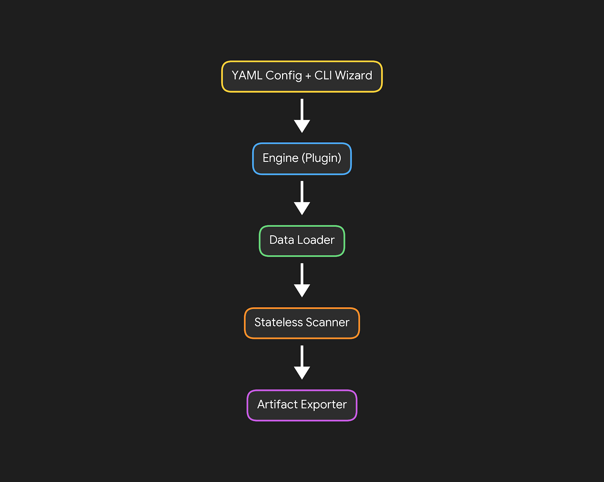

# System Architecture & Infrastructure

The KANG Quantitative Research Framework is built upon the principle of **Separation of Concerns**. In early iterations of the project, data loading, configuration, trading logic, and performance logging were tightly coupled within single monolithic scripts. This created technical debt and made testing new hypotheses cumbersome and error-prone.

The current architecture entirely decouples the execution environment from the research logic, resulting in a modular, highly scalable "Plugin Architecture."

## 1. Dynamic Plugin Discovery (The CLI Wizard)

To eliminate the need for hardcoded execution scripts, the framework utilizes an Interactive Command Line Interface (CLI) built on dynamic module discovery.

- **Registry Scanning:** The launcher (`launch.py`) dynamically scans the `backtesting/engines/` directory for any Python files matching the prefix `kang_*.py`.
- **Decoupled Execution:** When a researcher creates a new hypothesis engine (e.g., `kang_momentum_v1.py`), it is automatically detected and added to the terminal UI menu without requiring any modifications to the core infrastructure.
- **Standardized Interface:** Every strategy engine conforms to a strict entry-point signature (`run_research(symbol, start_dt, end_dt)`), allowing the CLI wizard to pass environmental parameters universally.

CLI Wizard Screenshot:

A terminal screenshot showing the dynamic menu asking for Instrument, Research Mode, and Date Range.

## 2. Configuration & Environment Management

Environmental variables and instrument metadata are strictly isolated from the Python execution logic to prevent hardcoding errors.

- **Declarative Data (`settings.yaml`):** Stores static facts such as directory paths, instrument spread profiles, pip multipliers, and predefined Out-of-Sample (OOS) date ranges.
- **Singleton Manager (`config_manager.py`):** Parses the YAML file and exposes safe, type-hinted methods to the strategy engines. This allows engines to execute calculations relative to an instrument's specific pip-value without knowing which asset they are processing.

## 3. High-Performance Data Lake

The framework utilizes Apache Parquet for historical market data storage, offering significant compression and read-speed advantages over traditional CSVs.

- **Universal Data Loader:** The `data_loader.py` module acts as the gatekeeper for data ingestion. It lazy-loads only the specific timeframes requested by the active research engine.
- **Timezone Normalization:** Raw historical datasets are processed to align perfectly with live broker server times (accounting for regional Daylight Saving Time shifts) to ensure spatial geometry remains consistent between backtesting and live execution.

## 4. Stateless Array Processing

A critical architectural decision was the shift from stateful class-based market scanners to **stateless, vectorized functional arrays**.

In stateful scanners, evaluating historical bars sequentially mutates internal object states, which can cause state-corruption or "memory leaks" when running multi-threaded optimizations or repeatedly instantiating objects in a backtest loop. The KANG framework utilizes functional components (`level_scanner2.py`) that evaluate pure NumPy and Pandas arrays, guaranteeing deterministic outputs and thread-safe execution across millions of historical bars.

## 5. Artifact Exporting & Reproducibility

Quantitative research is only valid if it is reproducible. The framework's artifact exporter ensures that no historical run is ever accidentally overwritten or lost.

- **Unique Hashes:** Every completed research run exports a CSV appended with an execution timestamp and a unique 6-character MD5 hash.
- **Metadata Manifests:** Alongside every CSV dataset, the engine generates a `.json` sidecar file containing the exact configuration parameters, strategy name, and environment variables used during the run. This guarantees that an external researcher can perfectly recreate the experimental conditions months or years later.

---

Architecture Flow Diagram:

A block diagram showing the flow: YAML Config + CLI Wizard -> Engine (Plugin) -> Data Loader -> Stateless Scanner -> Artifact Exporter.
