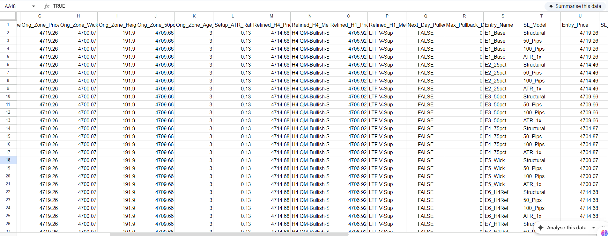

# Quantitative Research Methodology

The objective of the KANG framework is not to build a "portfolio backtester" that outputs a single equity curve, but rather to operate as a research laboratory. The methodology focuses on profiling market behavior, measuring statistical significance, and engineering rich feature sets for downstream Machine Learning (ML) analysis.

## 1. Hypothesis Formulation

Research within the framework begins with defining clear, falsifiable geometric market hypotheses.
For example, the baseline engine investigates the statistical probabilities of mean-reversion following the creation of multi-timeframe spatial market structures. Rather than asking "Is this strategy profitable?", the framework asks: _"If price rejects a known structural boundary, what is the probability it pulls back to the origin, and what is the optimal geometric depth of that pullback?"_

## 2. Multi-Grid Parameter Simulation ("Long Format" Datasets)

Traditional backtesters force the researcher to define a single entry condition and a single stop-loss model before running the simulation. This obscures valuable data regarding alternative outcomes.

The KANG framework utilizes a **Multi-Grid Simulation** approach. For every detected market setup, the engine simultaneously simulates:

- Multiple spatial entry coordinates (e.g., Base close, 25% depth, 50% equilibrium, extreme wick).
- Multiple risk models (e.g., Structural boundary, Fixed Pip distances, Volatility/ATR-based distances).

This outputs a denormalized, "Long Format" dataset where one market setup generates dozens of distinct, simulated execution rows. This format is heavily optimized for pivot-table analysis and ML feature engineering, allowing researchers to build probability curves of penetration depth versus win rate.

## 3. Execution Profiling: MAE & MFE

Binary tracking of "Wins" and "Losses" is insufficient for professional quantitative research. A trade that immediately goes into deep drawdown before eventually hitting the target exhibits a vastly different risk profile than a trade that never faces adverse excursion.

The simulation engine records tick-by-tick intraday data to calculate:

- **Maximum Adverse Excursion (MAE):** The maximum distance price moved against the position before the exit. Analyzing MAE across winning trades allows researchers to mathematically optimize Stop-Loss placement.
- **Maximum Favorable Excursion (MFE):** The maximum distance price moved in favor of the position before failing. Analyzing MFE across losing trades provides empirical data for optimal Take-Profit scaling.
- **Holding Time:** The precise duration between limit order fill and terminal exit, providing insight into capital velocity and opportunity cost.

## 4. Data Regimes & Out-of-Sample (OOS) Isolation

To combat overfitting and data snooping, the framework enforces strict separation between In-Sample training data and Out-of-Sample (OOS) validation data.

Historical datasets are physically partitioned into distinct Parquet files (e.g., `XAUUSD_D1.parquet` vs. `XAUUSD_D1_OOS.parquet`). This physical separation ensures that optimization algorithms and ML models cannot accidentally ingest future market regimes during the training phase.

## 5. Bridging the Live Execution Gap

A critical element of the methodology is ensuring that historical simulations accurately reflect live market mechanics.

In live environments, algorithmic execution via cron jobs or server polling introduces inherent latency. To account for this, the live execution modules associated with the KANG framework utilize a **Price Improvement Override** mechanism. If a pending limit order price is surpassed favorably during the fractional delay of a server execution cycle, the system automatically overrides the limit order with a direct market order. This logic captures optimal institutional fills and ensures that the historical backtest's assumption of limit-order execution remains robust in live forward-testing.

---

IMAGE PLACEHOLDERS FOR THIS FILE:

1. Dataset Output Screenshot:
   - Location: Under Section 2 or 3
   - Markdown: 
   - Save As: `screenshots/sanitized_dataset_sample.png`
   - Suggested Content: A cropped screenshot of the CSV output showing columns like Entry_Name, SL_Model, MAE_Pips, MFE_Pips, and Target_RR. (Ensure proprietary columns like Orig_Zone_Type are hidden or cropped out).
