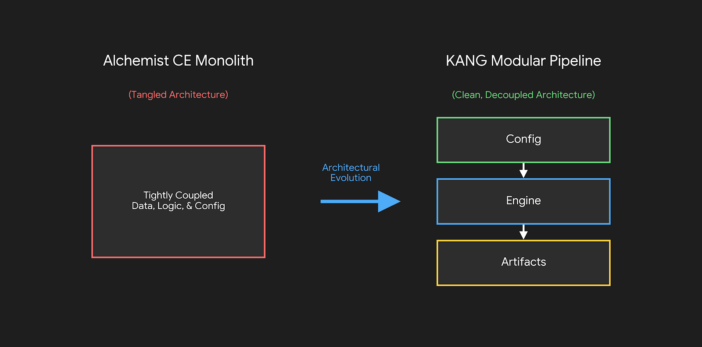

# Framework Evolution: From Monolith to Modular Research

The KANG Quantitative Research Framework was not initially designed as a generalized testing laboratory. Its architecture is the direct result of encountering, diagnosing, and resolving severe methodological flaws in an earlier algorithmic implementation.

This document outlines the transition from a monolithic trading script to a decoupled quantitative research framework.

## 1. The Monolithic Origins (Alchemist CE)

The project began as **Alchemist CE**, a highly specific automated trading system designed to capitalize on spatial market geometry.

- **Tight Coupling:** Data ingestion, signal generation, risk management, and performance logging were heavily intertwined within a single execution loop.
- **Optimization Focus:** The primary objective was to find profitable parameters (e.g., optimal fixed stop-loss distances) using isolated ML optimization scripts, rather than validating the underlying geometric hypothesis.
- **Binary Outcomes:** The system tracked flat "Wins" and "Losses," discarding vital execution mechanics like intraday excursion and holding times.

## 2. Identifying Methodological Flaws

During the transition from historical backtesting to live forward-testing (via a MetaTrader 5 Expert Advisor), severe performance discrepancies emerged. A forensic parity audit between the historical database and live trade logs revealed two critical architectural failures:

- **Future Data Leakage (Look-Ahead Bias):** The backtest engine was iterating over datasets anchored to the candle open ($T_{open}$), but utilizing confirmation signals that did not physically exist until the candle close ($T_{close}$). This permitted the engine to execute simulated limit orders retroactively.
- **State-Machine Corruption:** The object-oriented level scanner maintained active memory of structural breaks. During multi-threaded parameter sweeps, state persistence occasionally leaked across testing loops, corrupting structural tracking.

## 3. Abstracting the Architecture (KANG)

Rather than patching the isolated bugs, the decision was made to halt optimization and engineer a sterile, causal environment. The monolith was disassembled into the **KANG Quantitative Research Framework**:

- **Configuration Decoupling:** Hardcoded variables were stripped from the execution logic and centralized into language-agnostic YAML configuration files.
- **Stateless Processing:** The level scanner was rewritten as a purely functional array processor, guaranteeing thread-safe, deterministic outputs without state leakage.
- **Causal Data Slicing:** A strict temporal anchoring system was introduced. The engine now slices lower-timeframe validation arrays exclusively up to the $T_{close}$ decision boundary, mathematically enforcing chronological integrity.

## 4. The New Research Paradigm

The structural rebuild fundamentally changed the objective of the codebase. Instead of functioning as a "trading bot," the repository operates as an empirical testing laboratory.

The framework no longer asks, _"Is this strategy profitable?"_ Instead, it evaluates multiple entry coordinates and risk models simultaneously to generate denormalized, "Long Format" datasets. This pipeline produces the rich Maximum Favorable Excursion (MFE) and Maximum Adverse Excursion (MAE) metrics required for advanced Machine Learning feature engineering and rigorous hypothesis validation.

---

<!--
IMAGE PLACEHOLDERS FOR THIS FILE:
1. Evolution Diagram:
   - Location: Bottom of the file
   - Markdown: 
   - Save As: `diagrams/evolution_diagram.png`
   - Suggested Content: A visual showing the transition from the tangled "Alchemist CE Monolith" to the clean, decoupled "KANG Modular Pipeline" (Config -> Engine -> Artifacts).
-->
